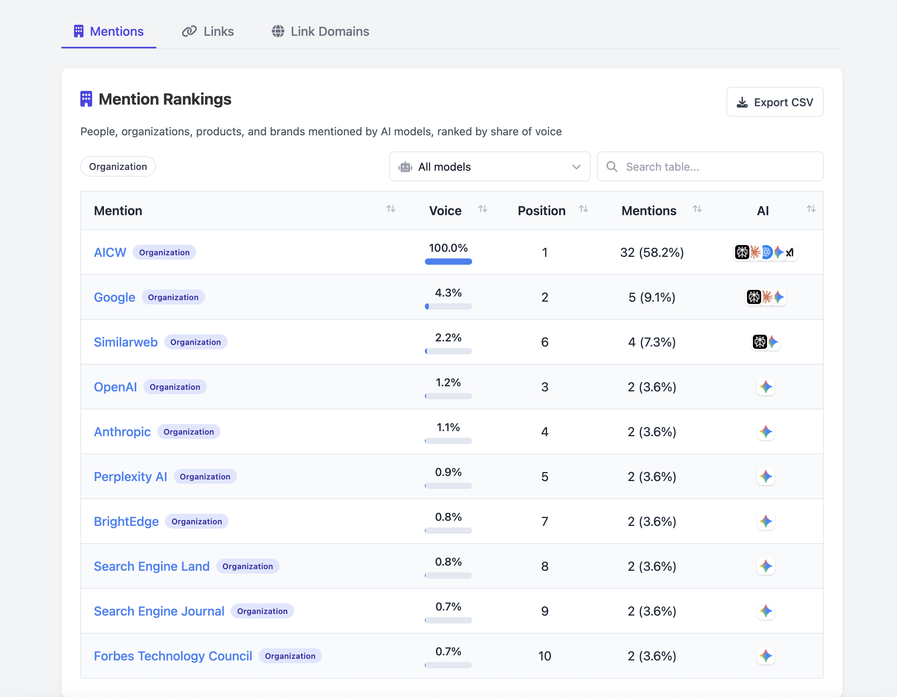
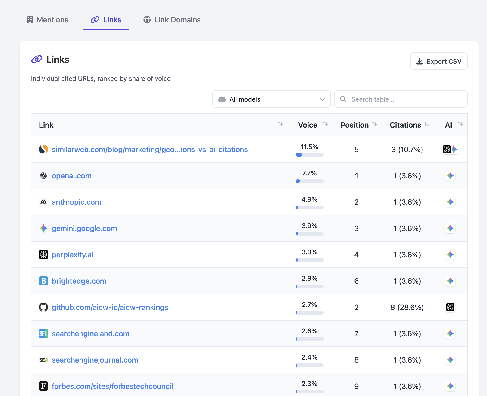
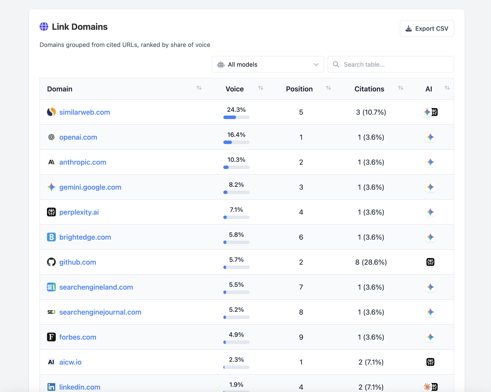

# AICW AI Mentions

Open-source CLI for checking how AI assistants mention a company, product, person, or topic.

It asks multiple AI models the same questions, extracts mentions and cited links, then builds a local HTML report with:

- mention rankings
- cited links
- link domains
- model filters, search, and CSV export

Live demo: https://aicw.io/aicw-ai-mentions-demo/

## Screenshots

### Mentions



### Links



### Link Domains



## Install

Run without a global install:

```bash
npx aicw-ai-mentions@latest setup-api-key
npx aicw-ai-mentions@latest scan "Stripe"
npx aicw-ai-mentions@latest serve
```

Or install globally:

```bash
npm install -g aicw-ai-mentions
aicw-ai-mentions setup-api-key
aicw-ai-mentions scan "Stripe"
aicw-ai-mentions serve
```

Then open the local report URL printed by `serve`.

## Requirements

- Node.js 18+
- An OpenRouter API key

The bundled OSS model presets use OpenRouter by default because one key can route requests to multiple AI assistants. You can provide the key with:

```bash
export OPENROUTER_API_KEY=sk-or-...
```

or run:

```bash
aicw-ai-mentions setup-api-key
```

`setup-api-key` stores the key in your local AICW data folder. You can also put `OPENROUTER_API_KEY` in `.env.local` or `.env`.

## Build The Demo

From a local checkout:

```bash
npm install
OPENROUTER_API_KEY=sk-or-... npm run demo:build
```

The demo runs:

```bash
aicw-ai-mentions scan "AICW AI Mentions" --questions 1
```

and writes a static report to:

```text
demo/core/index.html
```

## Local Data

Reports, logs, cache files, and saved credentials stay on your machine.

Default data folders:

- macOS: `~/Library/Application Support/aicw/`
- Windows: `%APPDATA%\aicw\`
- Linux: `~/.config/aicw/`

Link verification is optional and off by default. Update checks only show a notice when a newer npm version exists; they do not install anything automatically.

## Development

```bash
git clone https://github.com/aicw-io/aicw-ai-mentions.git
cd aicw-ai-mentions
npm install
npm test
npm run build
```

Useful local commands:

```bash
npm run demo:build
npm run package:dry
node bin/aicw-ai-mentions.js help
```

## License

See [LICENSE](LICENSE).
